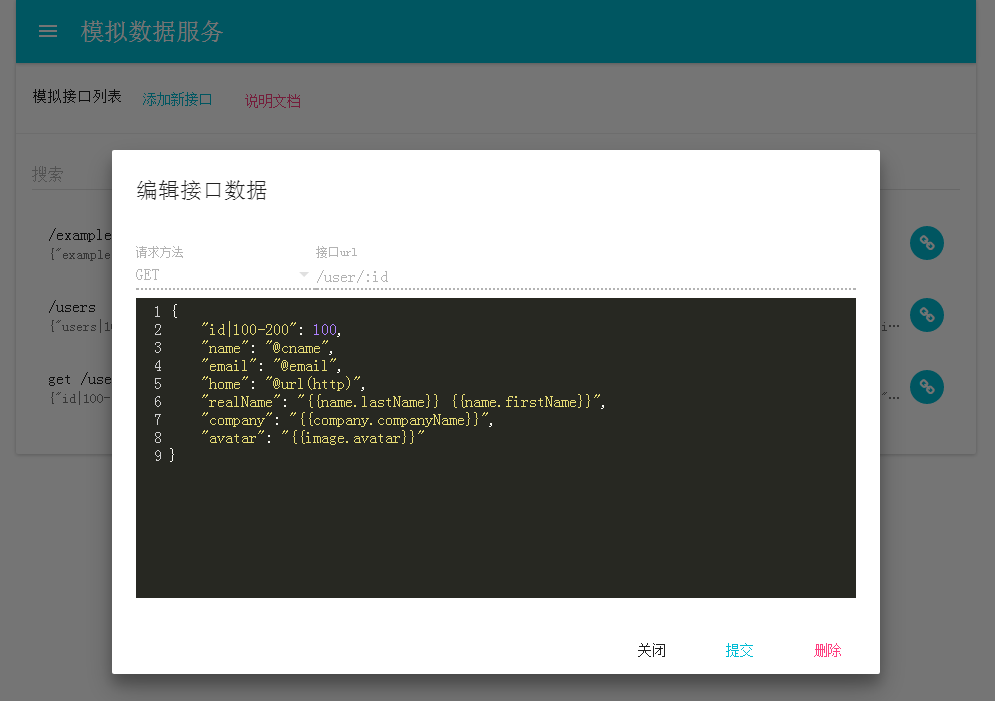

# 模拟数据服务

定义数据结构，自动生成模拟数据，方便在开发阶段迅速集成数据



# 安装

```
npm i -g mock-server-cli
```

# 使用

## 启动

```shell
$ mock-server --help # 显示帮助信息

Usage: mock-server [options] [ --db mockdata | mockdata.json ]

Options:

  -h, --help                     output usage information
  -v, --version                  output the version number

  --port [number]                Port to use [3000]
  --db [string]                  use the json database
  --address [domain | ip]        Address to use [localhost]

$ mock-server  # 启动服务
mock server listening http://localhost:3000


```

## 管理面板

访问定义的域名(默认： localhost)与端口号(默认：3000)，可进入管理面板。即可看见当前项目已定义的所有接口，点击接口可以编辑接口。

```
http://localhost:3000
```


## 路由

定义模拟数据接口时，可选择请求方式 `任意` `GET` `POST` `PUT` `DELETE` `OPTIONS`。

接口url可填写具体url，也可以使用 `:param` 方式定义带参数的路由，如果使用参数路由，在数据定义中可以使用占位符 `@param(:param)` 获取参数

 - /user/:id => `@param(id)`
 - /user/:userid/info => `@param(userid)`


## 语法

本服务集成了 [mockjs](http://mockjs.com/) 与 [faker.js](http://marak.github.io/faker.js/) 语法

### mockjs

 - 官网: http://mockjs.com/
 - 文档: https://github.com/nuysoft/Mock/wiki
 - 示例: http://mockjs.com/examples.html

mockjs在key使用 `|` 符号定义数据结构，在 value 使用 `@` 定义数据类型，如

```json
{
    "users|10-50": [{ // 生成 10-50 个元素的数组
        "id|+1": 10, // 从 10 开始，依次加 1
        "name": "@cname", // 随机生成一个中文名字
        "email": "@email", // 随机生成一个邮箱地址
        "home": "@url(http)" // 随机生成 http 协议的url
    }]
}
```

### faker.js

 - 官网 && 文档: http://marak.github.io/faker.js
 - 示例: https://cdn.rawgit.com/Marak/faker.js/master/examples/browser/index.html

因为 mockjs 可能无法满足数据类型的定义，特别引入了 faker.js 增加数据类型的定义，在 value 使用 `{{}}` 定义数据类型，如

```json
{
    "name": "{{name.lastName}} {{name.firstName}}",
    "company": "{{company.companyName}}",
    "avatar": "{{image.avatar}}"
}
```

### mockjs & faker.js

两种语法可以混用，使得更灵活配置

```json
{
    "users|10-50": [{ 
        "id|+1": 10, 
        "name": "@cname", 
        "email": "@email", 
        "home": "@url(http)",
        "realName": "{{name.lastName}} {{name.firstName}}",
        "company": "{{company.companyName}}",
        "avatar": "{{image.avatar}}"
    }]
}
```

### 函数

里面可以写一个函数，在保存时会执行函数 __取返回值保存__ 
